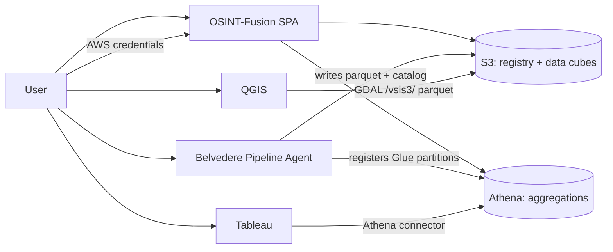

# OSINT-Fusion — Project Plan

> **Status:** Ready for implementation (2026-09-09).

## 1. Architecture Overview



### Design constraints

- **Bring-your-own-credentials (BYOC):** Users enter AWS access key, secret, and optional session token. Credentials live in `sessionStorage` for the tab session only — no server-side persistence.
- **Shared data, no auth:** All requests and cubes are visible to anyone with bucket read access. No user accounts or RBAC.
- **Belvedere builds cubes:** The app manages request lifecycle and exploration; Belvedere writes parquet, manifests, schemas, and Glue/Athena catalog entries.
- **Direct tool connections:** QGIS reads parquet from S3 via GDAL `/vsis3/`. Tableau uses the Athena connector against the shared Glue table. No app proxy.

### Tech stack

| Layer | Choice |
|-------|--------|
| SPA | React + Vite + TypeScript |
| Routing | React Router |
| AWS SDK | AWS SDK for JavaScript v3 (S3, Athena, STS) |
| Styling | Tailwind CSS + military theme |
| Client state | React Query + session-scoped credential context |
| Hosting | Static build (S3 + CloudFront or Vite dev) |

---

## 2. AWS Environment

| Setting | Value |
|---------|-------|
| Bucket | `cf-hackathon` |
| App prefix | `osint-fusion-app/` |
| Region | `us-east-1` |
| Environments | Single bucket for all envs |

### Credential gate

Users provide access key, secret, optional session token, and region (`us-east-1` default). The app validates via `sts:GetCallerIdentity` before enabling operations. SSO and profile import are out of scope for v1.

### Required IAM permissions

```
s3:ListBucket          on arn:aws:s3:::cf-hackathon  (prefix: osint-fusion-app/*)
s3:GetObject           on arn:aws:s3:::cf-hackathon/osint-fusion-app/*
s3:PutObject           on arn:aws:s3:::cf-hackathon/osint-fusion-app/requests/*
athena:StartQueryExecution, athena:GetQueryExecution, athena:GetQueryResults
glue:GetDatabase, glue:GetTable, glue:GetPartitions
```

### Glue / Athena catalog

Belvedere auto-registers a **single shared external table** `osint_cube` when cubes are built. All requests write parquet under their own prefix; catalog partitions include `request_id`, `source_type`, and `source_producer`. The app queries with `WHERE request_id = '{request-id}'`. Table name may also appear in `_manifest.json`.

---

## 3. S3 Layout

```
s3://cf-hackathon/osint-fusion-app/
├── registry/
│   ├── requests.json
│   └── schemas/
│       ├── index.json
│       └── {schema-id}.json
├── requests/
│   └── {request-id}/
│       ├── request.json
│       └── cube/
│           ├── _manifest.json
│           ├── schema.json
│           ├── data/
│           │   └── source_type={type}/
│           │       └── source_producer={producer}/
│           │           └── part-{n}.parquet
│           └── artifacts/
│               └── {artifact-id}/...
└── athena-results/
```

### Artifacts

Max **500 MB** per artifact; any MIME type. Binary files live under `cube/artifacts/`; parquet records reference them via `artifact_refs`.

### `request.json`

```json
{
  "request_id": "uuid",
  "topic": {
    "narrative": "Maritime activity in Strait of Hormuz",
    "geofence": { "type": "Polygon", "coordinates": [[[...]]] },
    "time_range": { "start": "2026-01-01T00:00:00Z", "end": "2026-03-01T00:00:00Z" }
  },
  "created_at": "2026-09-09T17:00:00Z",
  "status": "pending | building | ready | failed",
  "cube_s3_prefix": "s3://cf-hackathon/osint-fusion-app/requests/{request-id}/cube/"
}
```

At least one `topic` field (narrative, geofence, or time range) should be present.

### Readiness and failure

On **manual refresh**, the app checks:

1. `_manifest.json` with `"status": "ready"`, or
2. `schema.json` plus at least one `.parquet` under `cube/data/`

Belvedere sets `"status": "failed"` in `_manifest.json` (with optional error message) when a pipeline fails. The UI should distinguish explicit failure from a long-running `building` state with no manifest update.

---

## 4. Belvedere Handoff

Belvedere has `cf-hackathon/osint-fusion-app` **pre-cataloged** and resolves the cube path from `request-id` alone. The app does not pass bucket configuration or S3 URIs in the agent message.

### New request flow

1. User enters topic via the new-request wizard (narrative, map-drawn geofence, time range — any combination).
2. App generates `request_id`, writes `request.json`, updates `registry/requests.json`, creates the cube prefix.
3. App shows the Belvedere pipeline link (`VITE_BELVEDERE_PIPELINE_URL`) and a copy-ready agent message. No URL query-parameter pre-fill — user pastes the message into Belvedere chat.

### Agent message template

```
Collection request ID: {request-id}

Topic narrative:
{narrative or "(not provided)"}

Geofence (GeoJSON):
{geofence JSON or "(not provided)"}

Time range:
{start} to {end} or "(not provided)"}

Please build the OSINT data cube for this collection request using the cataloged S3 destination for request {request-id}.
Write parquet partitions, schema.json, and _manifest.json when complete.
Set payload_schema_ref on each record to a schema id from the global registry (registry/schemas/index.json).
Register any new payload JSON Schemas in the global registry before referencing them.
```

Belvedere writes `_manifest.json`, per-cube `schema.json`, parquet data, Glue partitions, and any new entries in the payload schema registry.

---

## 5. Data Cube Schema

### Parquet columns

| Column | Type | Req | Description |
|--------|------|-----|-------------|
| `record_id` | STRING | yes | UUID |
| `request_id` | STRING | yes | Parent collection request |
| `source_type` | STRING | yes | One of the canonical enum values (below) |
| `source_producer` | STRING | yes | e.g. `OpenStreetMap`, `BlueSky`, `Sentinel-2` |
| `observed_at` | TIMESTAMP | yes | Observation time (UTC) |
| `ingested_at` | TIMESTAMP | yes | Ingest time (UTC) |
| `payload_json` | STRING | yes | JSON conforming to the referenced schema |
| `payload_schema_ref` | STRING | yes | ID in `registry/schemas/index.json` |
| `lat` | DOUBLE | no | Optional centroid latitude |
| `lon` | DOUBLE | no | Optional centroid longitude |
| `title` | STRING | no | Display label |
| `summary` | STRING | no | Short text summary |
| `confidence` | DOUBLE | no | 0.0–1.0 |
| `artifact_refs` | ARRAY&lt;STRUCT&lt;…&gt;&gt; | no | Pointers under `artifacts/` |
| `tags` | ARRAY&lt;STRING&gt; | no | Additional facets |
| `lineage` | STRUCT&lt;…&gt; | no | Pipeline provenance |

Geographic structure lives in `payload_json`, described by the referenced JSON Schema (e.g. `geojson-feature`). No WKT or other denormalized geometry columns.

### Canonical `source_type` values

Fixed enum with display labels and UI icons:

- `Infrastructure`
- `SocialMedia`
- `EntityTracks`
- `EarthObservations`
- `Demographics`

### Partition layout

```
cube/data/source_type={SourceType}/source_producer={Producer}/part-0001.parquet
```

### Per-cube `schema.json`

Written by Belvedere on completion. Lists source types, producers, record counts, and `payload_schema_refs` used in the cube.

### Global payload schema registry

Payload types are JSON Schema files registered once under `registry/schemas/`. Belvedere is the sole registrar of new schemas.

**Bootstrap set (v1):** `generic-object`, `geojson-feature`, `bluesky-post`, `osm-element`, `stac-item`

**`registry/schemas/index.json`** catalogs each schema's `id`, `label`, `description`, and `s3_uri`. Parquet records set `payload_schema_ref` to the `id`. The app resolves labels for exploration and Connect-tab guidance.

### Athena DDL

```sql
CREATE EXTERNAL TABLE osint_cube (
  record_id string,
  observed_at timestamp,
  ingested_at timestamp,
  payload_json string,
  payload_schema_ref string,
  lat double,
  lon double,
  title string,
  summary string,
  confidence double,
  artifact_refs array<struct<artifact_id:string,mime_type:string,s3_uri:string,role:string>>,
  tags array<string>,
  lineage struct<pipeline_run_id:string,belvedere_chat_id:string,extractor_version:string>
)
PARTITIONED BY (request_id string, source_type string, source_producer string)
STORED AS PARQUET
LOCATION 's3://cf-hackathon/osint-fusion-app/requests/';
```

---

## 6. Application Pages

### 6.1 Credential gate

Access key, secret, optional session token, region. Validate via STS; route to landing on success.

On first authenticated session the app bootstraps missing S3 registry/schema files and runs Athena DDL to create the `osint_fusion` database and `osint_cube` table. Failures show a banner linking to README manual setup.

### 6.2 Landing page

Request catalog from `registry/requests.json`: topic summary, status badge (PENDING / BUILDING / READY / FAILED), created date, record count when ready. CTA: **New Collection Request**.

### 6.3 New request wizard

1. Topic narrative (textarea)
2. Geofence via interactive map draw (polygon/rectangle → GeoJSON)
3. Time range (start/end pickers)

Submit writes S3 objects and opens the Belvedere handoff panel.

### 6.4 Request detail

**Not ready:** status panel, Belvedere link, copy agent message, manual refresh for readiness.

**Ready — tabs:**

| Tab | Content |
|-----|---------|
| Overview | Record count, source type count, producer count, breakdown by type (Athena + `schema.json`) |
| Sources | Source types from `schema.json`; expand producers and payload schema labels from registry |
| Connect | QGIS and Tableau connection instructions |

### 6.5 Connect tab

Text-only instructions for v1 (no screenshot assets).

**QGIS:** GDAL `/vsis3/` path to `s3://cf-hackathon/osint-fusion-app/requests/{request-id}/cube/data/`, partition layout, AWS credentials in environment, parsing `payload_json` when `payload_schema_ref` is `geojson-feature`.

**Tableau:** Athena connector to shared `osint_cube` table with `WHERE request_id = '{request-id}'`. Document database, workgroup, and output location configuration.

---

## 7. Visual Theme

| Element | Direction |
|---------|-----------|
| Palette | Dark olive/charcoal (`#1a1f16`, `#2d3a2a`), gold accent (`#c4a035`) |
| Typography | Condensed/stencil headings; clean sans body |
| Components | NATO-style status badges, bordered panels, subtle map watermark |
| Imagery | Source-type pictograms; text-first Connect instructions in v1 |
| Tone | "Collection Request", "Data Cube Ready", "Establish External Link" |

---

## 8. Implementation Phases

| Phase | Scope |
|-------|-------|
| **0 — Foundation** | Vite/React scaffold, military theme, credential gate, S3 + Athena SDK wiring |
| **1 — Request lifecycle** | Registry CRUD, map-draw wizard, Belvedere handoff, manual readiness refresh |
| **2 — Exploration** | `schema.json` + registry readers, Athena aggregations, Overview and Sources tabs |
| **3 — Connect** | QGIS `/vsis3/` and Tableau Athena text instructions |
| **4 — Hardening** | Tests, error states, env config, operator docs |

---

## 9. Environment Configuration

Build-time config (`.env`):

```
VITE_AWS_REGION=us-east-1
VITE_S3_BUCKET=cf-hackathon
VITE_S3_PREFIX=osint-fusion-app
VITE_BELVEDERE_PIPELINE_URL=https://belvedere.dev.aws.clearfracture.ai/pipelines/af42ef3e-...
VITE_ATHENA_DATABASE=osint_fusion
VITE_ATHENA_OUTPUT=s3://cf-hackathon/osint-fusion-app/athena-results/
```

Default Belvedere URL points to the hackathon dev pipeline unless overridden at build time.
