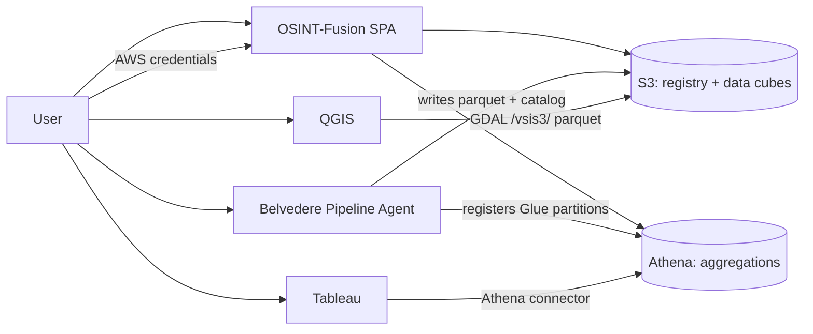

# OSINT-Fusion — Project Plan

> **Status:** Ready for implementation (2026-09-09).

## 1. Architecture Overview



### Design constraints

- **Bring-your-own-credentials (BYOC):** Users enter AWS access key, secret, and optional session token. Credentials live in `sessionStorage` for the tab session only — no server-side persistence.
- **Shared data, no auth:** All requests and cubes are visible to anyone with bucket read access. No user accounts or RBAC.
- **Belvedere builds cubes:** The app manages request lifecycle and exploration; Belvedere writes parquet, manifests, Glue/Athena catalog entries, and new payload JSON Schemas in the app registry when needed.
- **Schemas live in the app registry only:** JSON Schemas describing `payload_json` are stored under `registry/schemas/`. Parquet column layout is defined by the shared Glue/Athena table and embedded in each `.parquet` file — there is no per-cube `schema.json`.
- **Direct tool connections:** QGIS reads parquet from S3 via GDAL `/vsis3/`. Tableau uses the Athena connector against the shared Glue table. No app proxy.

### Tech stack

| Layer        | Choice                                          |
| ------------ | ----------------------------------------------- |
| SPA          | React + Vite + TypeScript                       |
| Routing      | React Router                                    |
| AWS SDK      | AWS SDK for JavaScript v3 (S3, Athena, STS)     |
| Styling      | Tailwind CSS + military theme                   |
| Client state | React Query + session-scoped credential context |
| Hosting      | Static build (S3 + CloudFront or Vite dev)      |

---

## 2. AWS Environment

| Setting      | Value                      |
| ------------ | -------------------------- |
| Bucket       | `cf-hackathon`             |
| App prefix   | `osint-fusion-app/`        |
| Region       | `us-east-1`                |
| Environments | Single bucket for all envs |

### Credential gate

Users provide access key, secret, optional session token, and region (`us-east-1` default). The app validates via `sts:GetCallerIdentity` before enabling operations. SSO and profile import are out of scope for v1.

### Required IAM permissions

```
s3:ListBucket          on arn:aws:s3:::cf-hackathon  (prefix: osint-fusion-app/*)
s3:GetObject           on arn:aws:s3:::cf-hackathon/osint-fusion-app/*
s3:PutObject           on arn:aws:s3:::cf-hackathon/osint-fusion-app/requests/*
athena:StartQueryExecution, athena:GetQueryExecution, athena:GetQueryResults
glue:GetDatabase, glue:GetTable, glue:GetPartitions
```

### Glue / Athena catalog

Belvedere auto-registers a **single shared external table** `osint_cube` when cubes are built. All requests write parquet under their own prefix; catalog partitions include `request_id`, `source_type`, and `source_producer`. The app queries with `WHERE request_id = '{request-id}'`. Table name may also appear in `_manifest.json`.

---

## 3. S3 Layout

```
s3://cf-hackathon/osint-fusion-app/
├── registry/                          ← app-owned metadata (shared across all requests)
│   ├── requests.json
│   └── schemas/
│       ├── index.json
│       └── {schema-id}.json
├── requests/
│   └── {request-id}/
│       ├── request.json
│       └── cube/                      ← Belvedere-owned data cube
│           ├── _manifest.json
│           ├── data/
│           │   └── source_type={type}/
│           │       └── source_producer={producer}/
│           │           └── part-{n}.parquet
│           └── artifacts/
│               └── {artifact-id}/...
└── athena-results/
```

---

## 4. Artifact Reference

### App registry artifacts (`registry/`)

These objects are owned and bootstrapped by the OSINT-Fusion app. They are shared across all collection requests.

| Artifact | Purpose | Format |
| -------- | ------- | ------ |
| `registry/requests.json` | Catalog index for the landing page: request ids, topic summaries, status, optional record counts | JSON: `{ "version": 1, "requests": [{ "request_id", "topic_summary", "created_at", "status", "record_count?" }] }` |
| `registry/schemas/index.json` | Global registry of payload JSON Schema ids, human labels, and S3 URIs to schema documents | JSON: `{ "version": 1, "schemas": [{ "id", "label", "description", "s3_uri", "media_type": "application/schema+json" }] }` |
| `registry/schemas/{schema-id}.json` | JSON Schema document describing the structure of `payload_json` for records referencing that id | JSON Schema (draft 2020-12); e.g. `geojson-feature`, `bluesky-post`, `osm-element` |

Belvedere may **append** new entries to `registry/schemas/index.json` and upload new `{schema-id}.json` files when ingesting novel payload shapes. The app never writes per-cube schema summaries.

### Per-request app artifacts (`requests/{request-id}/`)

| Artifact | Purpose | Format |
| -------- | ------- | ------ |
| `request.json` | Authoritative collection request record: topic, lifecycle status, cube S3 prefix | JSON (see below) |
| `cube/.keep` | Placeholder written at request creation so the cube prefix exists before Belvedere runs | JSON: `{ "created": "<ISO-8601>" }` |

#### `request.json`

```json
{
  "request_id": "uuid",
  "topic": {
    "narrative": "Maritime activity in Strait of Hormuz",
    "geofence": { "type": "Polygon", "coordinates": [[[...]]] },
    "time_range": { "start": "2026-01-01T00:00:00Z", "end": "2026-03-01T00:00:00Z" },
    "source_types": ["Infrastructure", "EntityTracks"]
  },
  "created_at": "2026-09-09T17:00:00Z",
  "status": "pending | building | ready | failed",
  "cube_s3_prefix": "s3://cf-hackathon/osint-fusion-app/requests/{request-id}/cube/"
}
```

`narrative` is **required** — the topic / question narrative that drives collection. All other topic fields are optional: `geofence`, `time_range`, and `source_types`. When `source_types` is omitted or empty, collection is not limited to specific categories. Values must be canonical enum ids: `Infrastructure`, `SocialMedia`, `EntityTracks`, `EarthObservations`, `Demographics`.

### Data cube artifacts (`requests/{request-id}/cube/`)

These objects are written by Belvedere. Column layout is defined by the shared `osint_cube` Glue table and embedded in Parquet — not by a separate JSON file in the cube prefix.

| Artifact | Purpose | Format |
| -------- | ------- | ------ |
| `_manifest.json` | Pipeline completion signal and optional error details | JSON: `{ "status": "building" \| "ready" \| "failed", "error_message?", "athena_table?" }` |
| `data/source_type={type}/source_producer={producer}/part-{n}.parquet` | OSINT records for this request, Hive-partitioned by source type and producer | Apache Parquet; columns match §6 (same as Glue `osint_cube` table) |
| `artifacts/{artifact-id}/…` | Binary attachments referenced from `artifact_refs` on parquet rows (images, documents, etc.) | Any MIME type; max **500 MB** per artifact |

Geographic structure lives in `payload_json`, described by the referenced JSON Schema from the app registry (e.g. `geojson-feature`). No WKT or other denormalized geometry columns in parquet.

### Readiness and failure

On **manual refresh**, the app checks:

1. `_manifest.json` with `"status": "ready"`, or
2. At least one `.parquet` file under `cube/data/`

Belvedere sets `"status": "failed"` in `_manifest.json` (with optional error message) when a pipeline fails. The UI should distinguish explicit failure from a long-running `building` state with no manifest update.

Exploration metrics (record counts, source breakdown, payload type labels) come from **Athena queries** against `osint_cube` and the **app registry** (`registry/schemas/index.json`), not from cube-local JSON.

---

## 5. Belvedere Handoff

Belvedere has `cf-hackathon/osint-fusion-app` **pre-cataloged** and resolves the cube path from `request-id` alone. The app does not pass bucket configuration or S3 URIs in the agent message.

### New request flow

1. User enters a required topic / question narrative and optional geofence, time range, and source types via the new-request wizard.
2. App generates `request_id`, writes `request.json`, updates `registry/requests.json`, creates the cube prefix.
3. App shows the Belvedere pipeline link (`VITE_BELVEDERE_PIPELINE_URL`) and a copy-ready agent message. No URL query-parameter pre-fill — user pastes the message into Belvedere chat.

### Agent message template

```
Collection request ID: {request-id}

Topic / question narrative:
{narrative}

Geofence (GeoJSON):
{geofence JSON or "(not provided)"}

Time range:
{start} to {end} or "(not provided)"}

Source types:
{comma-separated labels or "(not specified — any source type)"}

Please build the OSINT data cube for this collection request using the cataloged S3 destination for request {request-id}.
Write parquet partitions and _manifest.json when complete.
Set payload_schema_ref on each record to a schema id from the global registry (registry/schemas/index.json).
Register any new payload JSON Schemas in the global registry before referencing them.
Register Glue partitions on the shared osint_cube table.
```

Belvedere writes `_manifest.json`, parquet data, Glue partitions, and any new entries in the payload schema registry.

---

## 6. Data Cube Parquet Schema

Parquet files use the shared `osint_cube` external table definition. Each file is self-describing; the app and Athena read column metadata from Parquet/Glue, not from a cube-local JSON file.

### Parquet columns

| Column               | Type             | Req | Description                                                             |
| -------------------- | ---------------- | --- | ----------------------------------------------------------------------- |
| `record_id`          | STRING           | yes | UUID                                                                    |
| `request_id`         | STRING           | yes | Parent collection request (partition key)                               |
| `source_type`        | STRING           | yes | One of the canonical enum values (partition key)                        |
| `source_producer`    | STRING           | yes | e.g. `OpenStreetMap`, `BlueSky`, `Sentinel-2` (partition key)          |
| `observed_at`        | TIMESTAMP        | yes | Observation time (UTC)                                                  |
| `ingested_at`        | TIMESTAMP        | yes | Ingest time (UTC)                                                       |
| `payload_json`       | STRING           | yes | JSON conforming to the referenced payload schema                        |
| `payload_schema_ref` | STRING           | yes | ID in `registry/schemas/index.json`                                     |
| `lat`                | DOUBLE           | no  | Optional centroid latitude                                              |
| `lon`                | DOUBLE           | no  | Optional centroid longitude                                             |
| `title`              | STRING           | no  | Display label                                                           |
| `summary`            | STRING           | no  | Short text summary                                                      |
| `confidence`         | DOUBLE           | no  | 0.0–1.0                                                                 |
| `artifact_refs`      | ARRAY<STRUCT<…>> | no  | Pointers under `artifacts/` for binary objects linked in the payload    |
| `tags`               | ARRAY            | no  | Additional facets                                                       |
| `lineage`            | STRUCT<…>        | no  | Pipeline provenance                                                     |

### Canonical `source_type` values

Fixed enum with display labels and UI icons:

- `Infrastructure`
- `SocialMedia`
- `EntityTracks`
- `EarthObservations`
- `Demographics`
